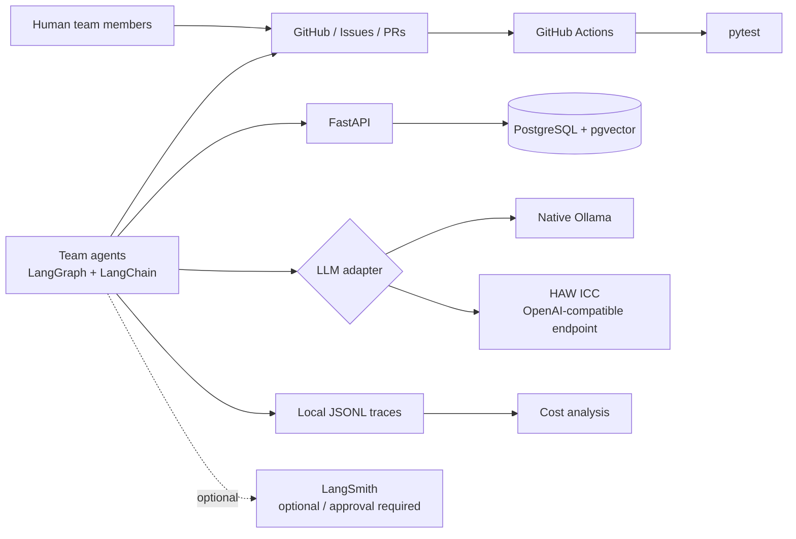

# Architecture – initial course baseline

> Team-owned after Session 1. Adapt this document so that it reflects the real company infrastructure.

## Baseline design decisions

1. Agent orchestration uses LangGraph.
2. LangChain provides model/integration abstractions.
3. Team code must not depend directly on a specific LLM deployment.
4. PostgreSQL + pgvector is the common relational and vector data platform.
5. Local structured traces are mandatory project evidence.
6. LangSmith is optional and cannot replace local evidence.
7. Ollama normally runs natively on the host when used on macOS.

## Team changes

Document all material changes here and add ADRs where appropriate.
